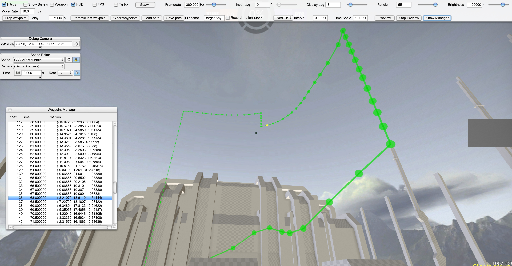
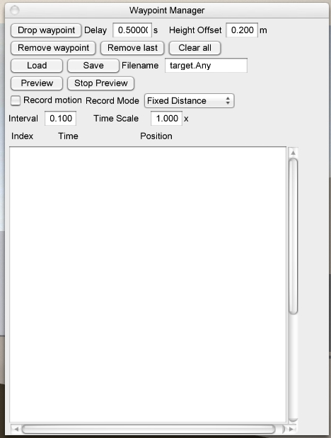

# Waypoint-based Path Editor
The waypoint-based path editor is a user-friendly way to create reproducible target paths from either realtime interactive sessions or recorded player motion. It is intended to be as simple, yet flexible as possible to allow for extension by the user.

## Features
The currently supported, in-app path editor features include:

* Manually drop waypoints at positions and pre-set timing (adjustable per point)
* Record your own motion
    * Distance based (constant speed replay)
    * Time based (your actual speed w/ an optional scale factor)
* Save/load existing paths
* Preview a loaded path using a dummy target
* Window-based manager for path editing/tweaking
    * Selection of an arbitrary point from a path list via list
    * Mouse-based selection of points
    * Remove the last dropped point
    * Remove an arbitrary dropped point
* Keyboard-based path position editing

## Waypoint Manager Window
The waypoint manager window provides access to all of the controls affiliated with waypoint management in the application.

### Dropping Waypoints
To drop a waypoint you can either use `Drop waypoint` button in the waypoint manager window, or can use the `Q` shortcut key to directly drop a waypoint in the application.

### Selecting Waypoints
You can select a waypoint either by clicking on it in the waypoint manager list view (this will highlight it blue and select the waypoint) or by aiming and clicking on the waypoint from the first-person view within the application.

A selected waypoint can be either modified or removed using additional steps.

### Removing Waypoints
Several options for removing waypoints available in app include: 
* Removing the last dropped waypoint
* Removing the currently selected waypoint
* Removing all waypoints

### Loading and Saving Existing Paths
To load an existing path (set of waypoints) use the `Load` button in the waypoint manager to open a file dialog to select the correct file to load. 

To save the current path to file, set the `Filename` field to the name of the file you would like to create (default output is to the `data-files` directory). Then click the `Save` button to write the path to the desired file.

### Path Preview
To preview a path with a default target model, press the `Preview` button at any time with the path loaded. To stop the preview use the `Stop Preview` button.

If you modify a path during a preview it is suggested that you stop/restart the preview to see the newest path.

### Player Motion Recording
Player motion recording is configured within the waypoint manager window in the developer mode (`playMode=False`) of the application. Once configured, recording can be toggled using the `R` key and a visual indicator for recording is presented in the top right of the display.

#### Motion Recording Modes
Player motion can be recorded in two different modalities with the application:

1. **Constant Time Interval**: In this approach, a constant time difference is used to record player motion. Once more time than the _recording interval_ (interpreted in seconds here) has passed the tool automatically grabs the player position and time and writes these to the destinations array.
2. **Constant Distance Interval**: In this approach, a constant distance difference is used to record player motion. Once the player has moved more than the _recording interval_ (interpreted in meters here) the tool automatically captures the new position and adds the `delay` field worth of time between each point (resulting in a constant velocity by default).

We recommend constant time interval recording for cases where the primary player motion of interest is based in a time-selection process (i.e. when a run starts) and constant distance interval recording for cases where the primary player motion of interest in based on a position-selection process (i.e. where the player is).

## Keyboard-based Path Editing
In addition to path recording and text-based editing for paths we now support a keyboard-based waypoint editing mode. The editor use the following keys for (axis-aligned) manipulation.

| Key       | Description           |
|-----------|-----------------------|
|`Insert`   | Move in +X direction  |
|`Delete`   | Move in -X direction  |
|`Page Up`  | Move in +Y direction  |
|`Page Down`| Move in -Y direction  |
|`Home`     | Move in +Z direction  |
|`End`      | Move in -Z direction  |

Remaining TODO Items:
---
* Click and hold/drag based interface for position points
* The position field should be extended to include rotation